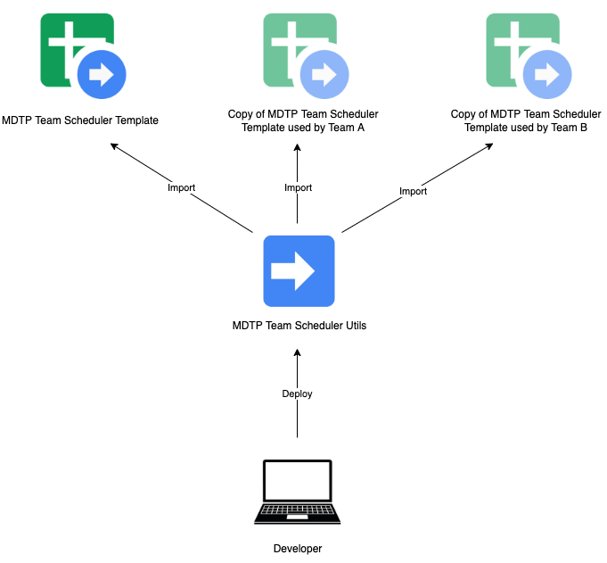

# mdtp-team-scheduler

[](https://confluence.tools.tax.service.gov.uk/display/Tools) **owned with pride by DDCOps**

mdtp-team-scheduler is used for managing a standalone Google App Scripts Project called [MDTP Team Scheduler Utils](https://script.google.com/home/projects/1RYw0hiv7edE3NNQt6biTZYKf19hPKUy6xX2dy4sxOAzRMtw2dnK5n23r/edit) which is used as a library for the [MDTP Team Scheduler Template](https://docs.google.com/spreadsheets/d/1Ke4Gds4wYJoyeywiTPNHdqg7PcsRVsIsdslYO5KJ-to/edit#gid=1415264265). This sheet is copied by teams and used for managing pair rotas, support rotas etc.

If your team is interested in copying the sheet for use, find an [confluence page here](https://confluence.tools.tax.service.gov.uk/pages/viewpage.action?spaceKey=PTSS&title=Team+Scheduling+Google+Sheet) which should give guidance.

This project uses [Clasp](https://github.com/google/clasp) for development of Google App Scripts Projects locally.



## Development

### Requirements
- Node v12.20.1

### Install
Install dependencies using: 
```shell
npm ci
```

## Deployment
To enable Google Apps Script API for your user, go to [Apps Script Settings](https://script.google.com/home/usersettings) and toggle Google Apps Script API to on.

Clasp needs access to push using your Google account. This can be achieved by running:

```shell
npx clasp login
```

This should open a browser which asks you to give Clasp access to the Google App Scripts API.

To deploy changes, run:

```shell
npx clasp push
```

### License

This code is open source software licensed under the [Apache 2.0 License]("http://www.apache.org/licenses/LICENSE-2.0.html").
